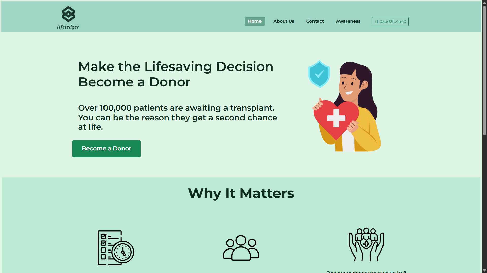
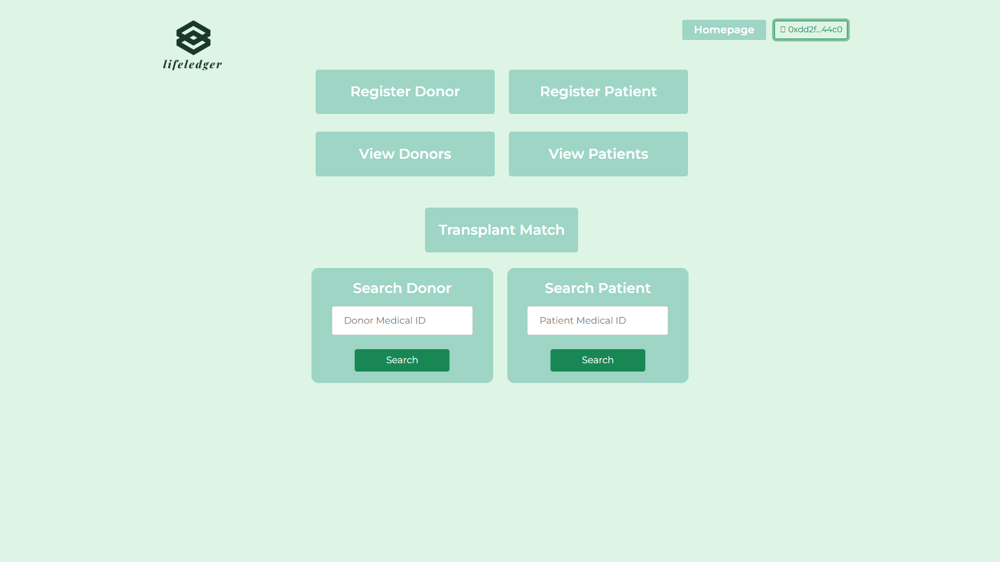
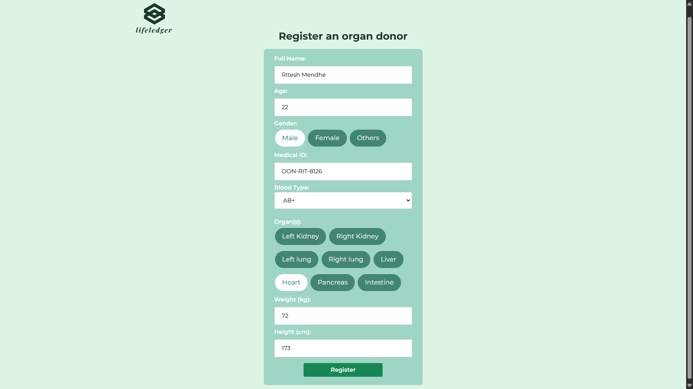
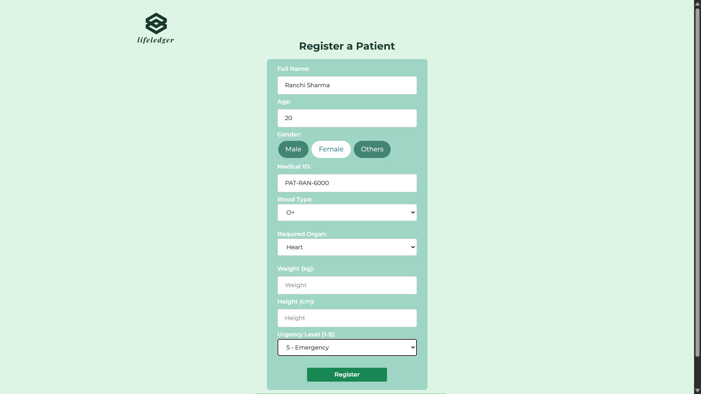
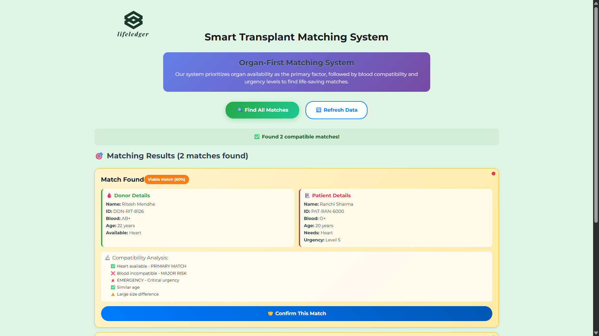
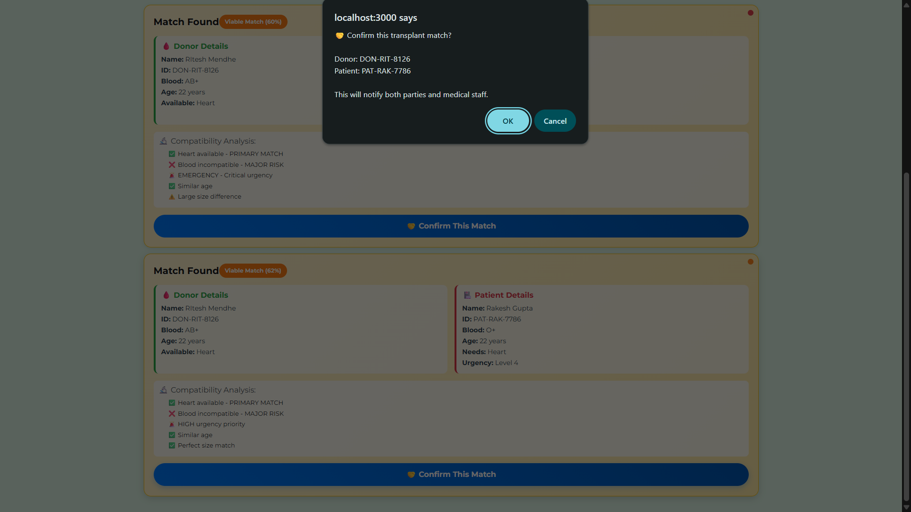

# 🌐 LifeLedger  
### *Decentralized Organ Donation & Transplant Management System*

LifeLedger is a blockchain-powered platform built using **Ethereum**, **Solidity**, **Hardhat**, and **Web3.js**.  
It provides a secure, transparent, and tamper-proof system for **Donor & Patient Registration**,  
**Organ/Blood Matching**, and **Real-time Blockchain Interaction**.

---

## 🚀 Key Features

### 1️⃣ Donor & Patient Registration  
Secure, immutable registration of medical data directly on the blockchain.

### 2️⃣ Automatic Medical ID Generation  
Unique blockchain-backed Medical IDs for both donors and patients.

### 3️⃣ Smart Contract-Based Matching  
Automated compatibility checks based on:
- Organ Type  
- Blood Group  
- Availability  

### 4️⃣ Real-time Blockchain Interaction  
Seamless Web3 connectivity enabling:
- Wallet connection  
- On-chain data read/write  
- Contract execution  

### 5️⃣ Email Notification System  
Optional email alerts whenever a donor–patient match is detected.

### 6️⃣ Tamper-Proof Storage  
Medical records stored securely on the Ethereum blockchain.

---

## 🛠 Tech Stack

### **Blockchain & Smart Contracts**
- Solidity  
- Hardhat  
- Ethereum (Sepolia Testnet)

### **Frontend**
- HTML  
- CSS  
- JavaScript (Vanilla / Bootstrap)

### **Blockchain Integration**
- Web3.js  
- Ethers.js

### **Backend (Optional)**
- Node.js  
- Express.js  
- Nodemailer (Email notifications)

---

## 📸 User Interface Preview

### 🏠 Landing Page  


### 📊 Dashboard  


### 🧑‍⚕️ Donor Registration  


### 🧑‍⚕️ Patient Registration  


### 🔍 Transplant Matching  


### 🔐 Confirmation mail



---

## ⚙️ Setup & Installation

Follow these steps to install, compile, and run LifeLedger locally.

### **1️⃣ Install Dependencies**
```bash
npm install
```

### **2️⃣ Configure Environment Variables**
Create a .env file in the project root and add:
```bash
PRIVATE_KEY=your_wallet_private_key
RPC_URL=https://eth-sepolia.g.alchemy.com/v2/your_rpc_url
```
### **3️⃣ Compile Smart Contracts**
```bash
npx hardhat compile
```
### **4️⃣ Deploy Smart Contracts (Sepolia or Localhost)**
```bash
npx hardhat run scripts/deploy.js --network sepolia
```
For local Blockchain(e.g.,Hardhat Node):
```bash
npx hardhat run scripts/deploy.js --network localhost
```
### **5️⃣ Start the Frontend**
```bash
npm run dev
```

Your app will be available at:

👉 http://localhost:5173/
 (Vite)
or
👉 http://localhost:3000/
 (React/Node)


